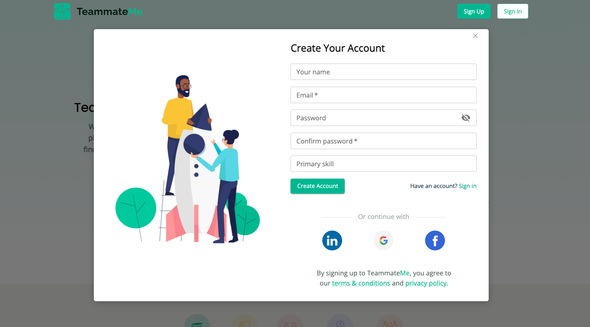
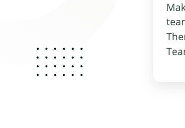
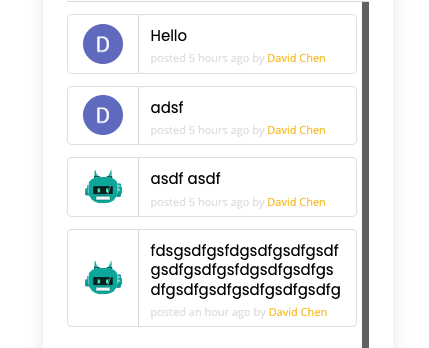
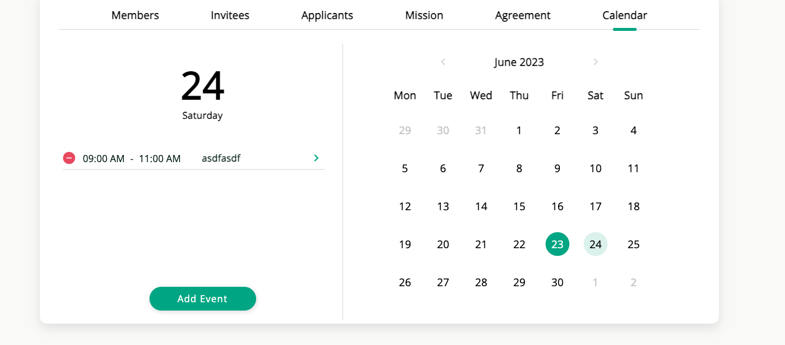
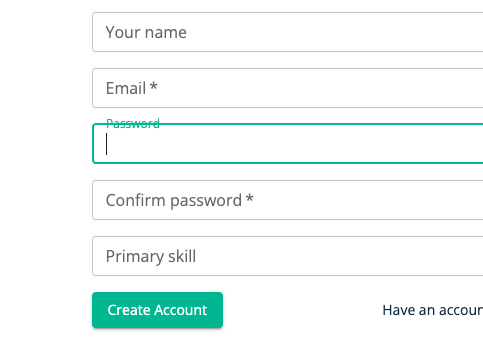
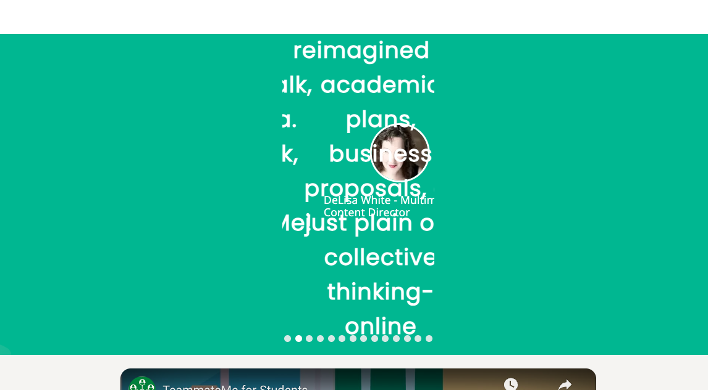
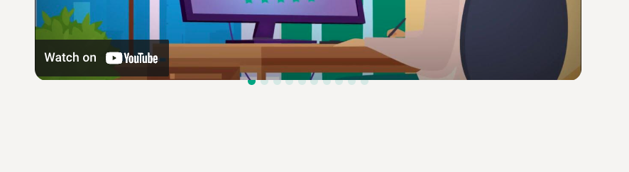
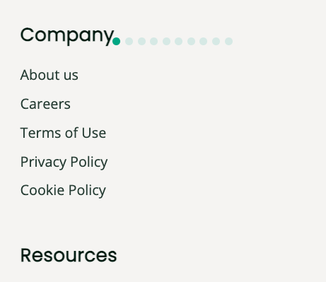

# Miniproposal for TeammateMe.net

## Sections:
- [Miniproposal for TeammateMe.net](#miniproposal-for-teammatemenet)
  - [Sections:](#sections)
  - [Feedback](#feedback)
  - [Suggestions](#suggestions)
  - [Bugs/Issues](#bugsissues)
---
## Feedback

> **GREAT IDEA!**
> 
> Overall, the website is very functional and clean.
> 
> OAuth works well and building teams is simple and easy.
>
> TeammateMe understands the importance of effective team dynamics and the impact it can have on the success of any endeavor. TeammateMe's platform empowers individuals to easily create or join teams based on their interests, skills, and project requirements. With a diverse user base spanning students, professors, gamers, professionals, and groups, TeammateMe offers a vibrant community where collaboration thrives.

---
## Suggestions
> **Chatbox:**
> 
> - Add a word count to text input
>
> - Option to add images and files to chatbox

> **Scroll:**
>
> - Disable Scrolling when modal is open
>
>

> **Dots:**
>
> - The styling of the dots are a little confusing
> 

> **Online:**
>
> - Show if teammate is online with green or red dot
> 

> **Calender:**
>
>  - Add events to google calender
> 
---
## Bugs/Issues

> **Password:**
>
> - Fix the CSS that's over password
>

> **Review:**
>
> - Fix the div that's holding the text image
>

> **YouTube:**
>
> - Video buttons are not directly below html element
>
>
>
> - Youtube buttons in mobile view does not align
>